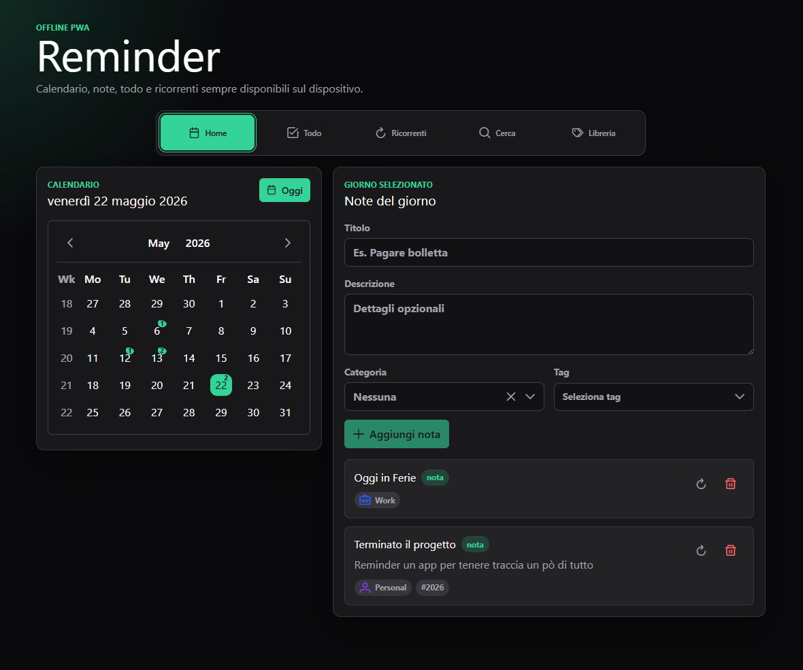
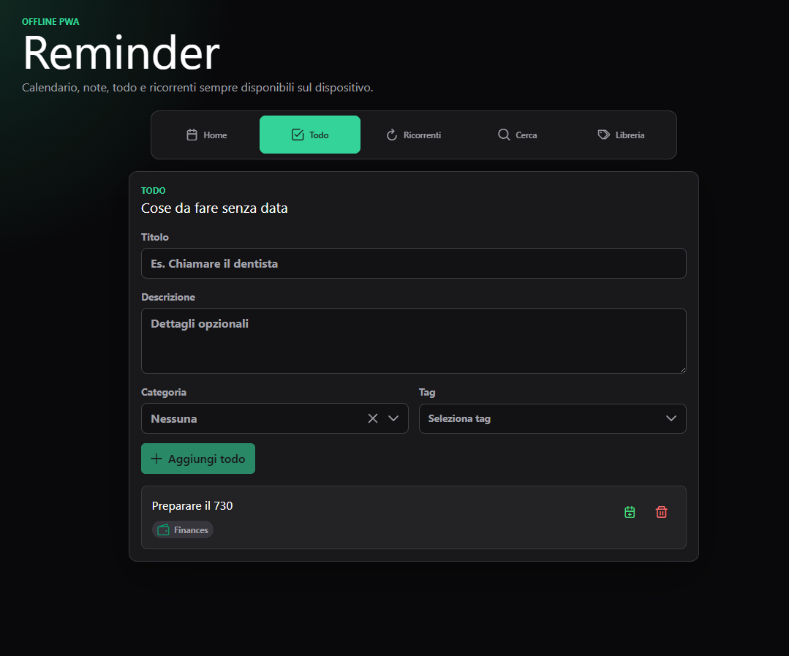
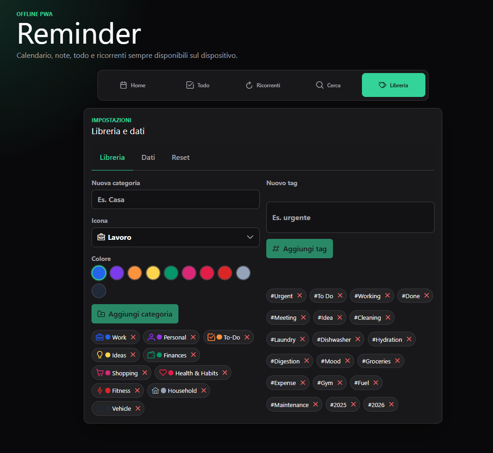

# Reminder

Reminder e una PWA offline-first pensata per tenere insieme calendario personale, note, cose da fare e piccoli promemoria ricorrenti. L'idea e semplice: apri l'app, scegli un giorno, scrivi quello che devi ricordare e lo ritrovi quando ti serve, anche senza connessione e senza creare account.

L'app nasce per un uso quotidiano e personale. Non prova a diventare un gestionale complesso: vuole essere un posto rapido, locale e sempre disponibile dove salvare appuntamenti, idee, attivita, abitudini, spese, manutenzioni, commissioni o qualsiasi informazione legata a una giornata.

## Anteprima







## Cosa puoi farci

- Usare un calendario mensile come punto di partenza principale.
- Creare note associate a una data specifica.
- Vedere subito quali giorni hanno contenuti salvati.
- Aggiungere titolo, descrizione, categoria e tag multipli alle note.
- Gestire todo non datati, utili per attivita ancora senza scadenza precisa.
- Convertire un todo completato in una nota del giorno corrente.
- Salvare una nota come template ricorrente.
- Copiare manualmente un template ricorrente nella giornata corrente.
- Cercare note per testo, intervallo di date, categoria e tag.
- Gestire una libreria locale di categorie e tag riutilizzabili.
- Esportare, importare o resettare i dati locali.
- Usare l'app come PWA installabile e cacheabile.

## Filosofia del progetto

Reminder e progettata per funzionare prima di tutto sul telefono. La prima schermata non e una landing page, ma l'app vera: calendario, contenuti del giorno selezionato e azioni rapide.

Tutti i dati restano sul dispositivo tramite IndexedDB. La v1 non prevede backend, account, cloud sync o notifiche push. Questa scelta rende l'app piu semplice, privata e adatta a essere usata anche offline.

I "ricorrenti" non sono automazioni calendariali: sono template manuali. Questo significa che l'app non genera note future da sola; sei tu a copiare un modello nel giorno corrente quando ti serve.

## Sezioni principali

### Home

La Home ruota attorno al calendario mensile. I giorni con note vengono evidenziati direttamente nel calendario, insieme al giorno corrente e al giorno selezionato. Selezionando una data puoi leggere le note esistenti o aggiungerne una nuova.

### Todo

La sezione Todo raccoglie attivita non ancora legate a una data. Quando completi un todo puoi eliminarlo oppure trasformarlo in una nota del giorno corrente, mantenendo titolo, descrizione, categoria e tag.

### Ricorrenti

I ricorrenti sono modelli riutilizzabili. Puoi crearli partendo da una nota e poi copiarli rapidamente nel giorno corrente. Sono utili per abitudini, checklist, promemoria ripetuti o attivita che tornano spesso ma non devono essere generate in automatico.

### Cerca

La ricerca lavora sui dati locali e permette di filtrare le note per testo, range di date, categoria e tag. Serve per recuperare facilmente informazioni salvate nel tempo.

### Libreria

La Libreria contiene categorie e tag riutilizzabili. Le categorie hanno colore e icona; i tag aiutano a classificare note, todo e template in modo piu flessibile.

## Stack tecnico

- Angular 21
- TypeScript
- PrimeNG 21
- PrimeIcons
- TailwindCSS 4
- NgRx Signals
- idb-keyval / IndexedDB
- Angular Service Worker per la modalita PWA
- Vitest come test runner configurato dal progetto Angular

## Architettura

Il progetto segue una struttura leggera ma ordinata:

- `src/app/app.ts`: shell principale e navigazione tra le sezioni.
- `src/app/calendar-view/`: vista calendario e note giornaliere.
- `src/app/todos-view/`: gestione dei todo non datati.
- `src/app/recurring-view/`: gestione dei template ricorrenti.
- `src/app/search-view/`: ricerca e filtri sulle note.
- `src/app/settings-view/`: libreria, import/export e reset dati.
- `src/app/shared/data-access/`: store e persistenza locale.
- `src/app/shared/models/`: tipi e modelli del dominio.
- `src/app/shared/ui/`: base UI condivisa tra le viste.
- `docs/`: documentazione di prodotto e regole tecniche.

## Documentazione

La cartella `docs/` contiene i documenti di riferimento del progetto:

- [Intent e feature](docs/project_intent_and_features.md)
- [Tech stack e regole](docs/teck_stack_and_rules.md)

## Avvio in locale

Installa le dipendenze:

```bash
npm install
```

Avvia il server di sviluppo:

```bash
npm start
```

Poi apri:

```text
http://localhost:4200/
```

## Build

Per creare una build di produzione:

```bash
npm run build
```

Gli artefatti vengono generati nella cartella `dist/`.

## Test

Per eseguire i test configurati nel progetto:

```bash
npm test
```

## Pubblicazione GitHub Pages

Il progetto include uno script dedicato alla build e pubblicazione su GitHub Pages:

```bash
npm run build-and-publish
```

Lo script usa il `base-href`:

```text
https://elpiu.github.io/reminder/
```

## Dati e privacy

Reminder salva i dati localmente nel browser, usando IndexedDB. Non c'e un backend remoto e non viene richiesta autenticazione. Se cancelli i dati del sito dal browser, anche i dati dell'app possono essere rimossi: usa export/import quando vuoi conservare una copia.
